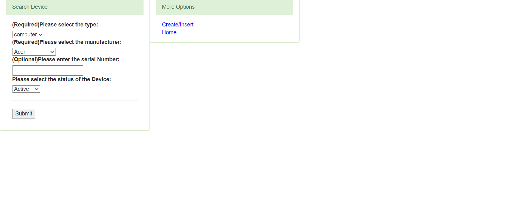
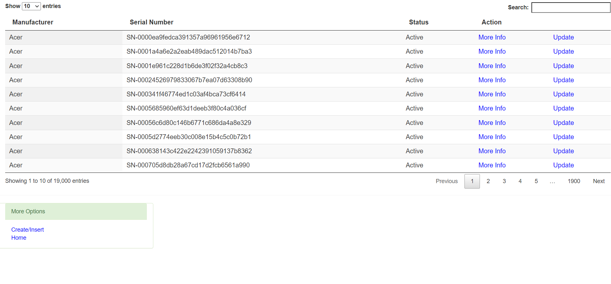
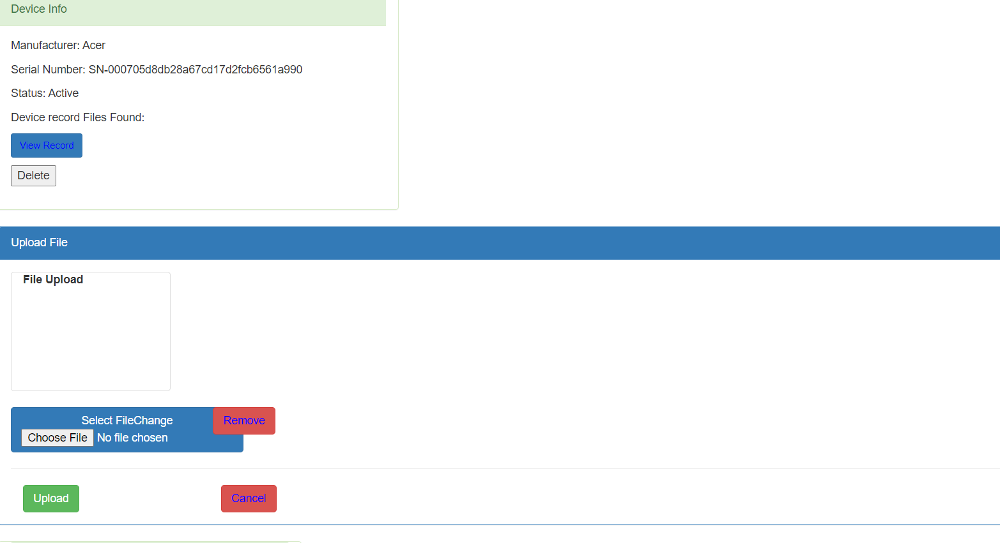
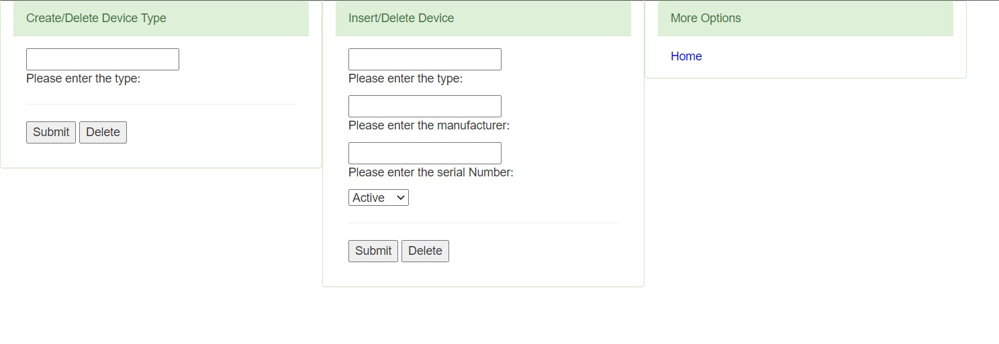
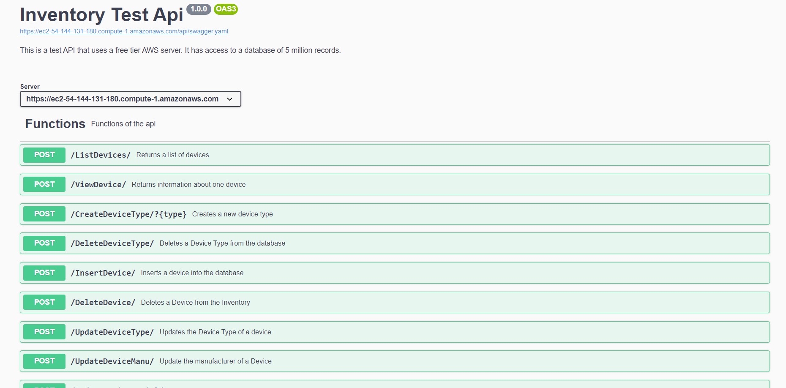

# Inventory-API
This repository contains the API and also the Web application version that pre-dates the api.
A small inventory API residing on a free tier AWS server(1 GB of ram 30 GB of storage). I also set up a database containing 5 million records.

# Web Applicatiction
This is the Web Application version that allows the user to interact with the 5 million record database.  
Link: https://ec2-54-144-131-180.compute-1.amazonaws.com/  

  
As seen in the image above it allows the user to search by: Device type, manufacturer, Serial Number and Status, with type and manufacturer being required.
This gives the user the ability to view the data returned in table format(see picture below).  
  
From there the user can choose to view the full information of a device and either view the files associated with it or upload file to the device.  
  
Or, the user can choose to update the device and also create new types or insert new devices into the tables if they want to.  
  

# API
This is API version of the above.
It has the all the functions of above, though I also added the ability to add a new manufacturer to the database.  

Link: https://ec2-54-144-131-180.compute-1.amazonaws.com/swagger/#/  

  
